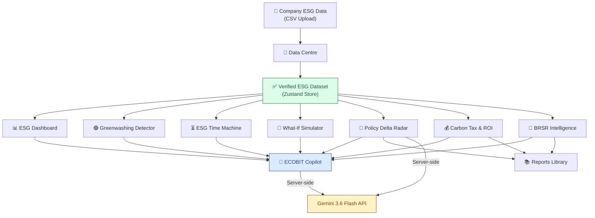

# 🌱 ECOBIT

### AI-Powered ESG Intelligence for a Changing Planet

[](https://react.dev)
[](https://vitejs.dev)
[](https://threejs.org)
[](https://ai.google.dev)
[](https://zustand-demo.pmnd.rs)
[](https://vercel.com)
[]()

ECOBIT transforms raw company ESG data into actionable sustainability intelligence — helping organizations measure environmental performance, detect greenwashing, understand policy risks, simulate future scenarios, estimate financial impact, and prepare BRSR-ready disclosures.

> **Built for hackathons. Designed for impact.**

---

## 🚀 Live Demo

<!-- Replace YOUR_VERCEL_URL_HERE with the actual Vercel deployment URL -->
> **Live Demo:** [🔗 ADD YOUR VERCEL DEPLOYED LINK HERE](YOUR_VERCEL_URL_HERE)

### 📸 Screenshots
<!-- Add screenshots or GIFs of key features here -->
<!-- Example:  -->
> [Add screenshots / GIFs here]

---

## 🔍 Problem Statement

Organizations today face a fragmented ESG landscape:

| Challenge | Impact |
|---|---|
| **Fragmented ESG data** | Spreadsheets, PDFs, and siloed databases make it difficult to build a unified picture of sustainability performance. |
| **Interpretation gap** | Raw operational numbers (kWh, litres, tonnes) don't tell decision-makers *what they mean* for compliance or strategy. |
| **Invisible sustainability gaps** | Without structured analysis, companies can't identify which metric to improve first or where the biggest environmental risk lies. |
| **Shifting regulatory requirements** | Indian regulations (SEBI BRSR, MoEFCC, BEE) and global standards (EU CSRD) evolve continuously, making compliance a moving target. |
| **Greenwashing risk** | Public sustainability claims may not align with actual operational data, creating regulatory and reputational exposure. |
| **Unknown financial consequences** | Sustainability decisions have direct carbon-pricing and capital expenditure implications that are difficult to quantify. |
| **BRSR reporting burden** | SEBI's BRSR framework requires structured, evidence-backed disclosures that are time-consuming to prepare manually. |
| **Static reporting** | Traditional ESG reports are snapshots — organizations need dynamic, actionable intelligence. |

---

## 💡 Solution

ECOBIT solves these problems through a unified intelligence pipeline:

```
UPLOAD DATA
     ↓
VERIFY & CALCULATE
     ↓
ANALYZE
     ↓
SIMULATE
     ↓
DETECT RISKS
     ↓
RECOMMEND ACTIONS
     ↓
GENERATE REPORTS
```

The **Data Centre** acts as the single source of truth. Once a company's operational ESG data is uploaded and verified, every module in ECOBIT — from the Greenwashing Detector to the BRSR Intelligence engine — reads from the same centralized, calculated dataset. No data duplication. No conflicting numbers.

---

## ✨ Features

### 🌍 1. Interactive 3D Experience

ECOBIT opens with a cinematic, immersive introduction:

- **Split-flap mechanical logo animation** — characters cascade and lock into "ECOBIT" like a vintage departure board.
- **Planetary HUD loader** — SVG circular progress ring with neon spectrum gradient, counter-rotating dashed HUD rings, orbiting scanner particle, and curved progress text.
- **Photorealistic rotating Earth** — Three.js globe with NASA daylight texture, custom GLSL shader ensuring global illumination (no pitch-black shadows), independent cloud layer rotation, cyan atmosphere shell, and 20 neon-blue orbital data stream ellipses with animated particles.
- **Floating 3D ESG labels** — Carbon, Renewable, Water, and ESG Score annotations hover around the Earth with sinusoidal floating physics.
- **Custom leaf cursor** — SVG leaf replaces the default cursor with smooth lag physics, velocity-based tilt, and particle trails on fast movement.
- **Glassmorphism design system** — Every panel uses multi-layer blur, translucent backgrounds, and crisp 1px borders for a premium nature-tech aesthetic.

---

### 📊 2. Data Centre

The foundational data ingestion layer.

- **CSV upload** with drag-and-drop or file browser, powered by PapaParse with dynamic typing.
- **Column validation** — verifies required fields (`electricity_kwh`, `renewable_percent`, `fuel_litres`, `water_m3`, `waste_tonnes`, `waste_recycled_percent`, `employees`, `female_employees`).
- **Pre-import preview** — review parsed data before committing.
- **One-click demo dataset** — instantly loads a realistic manufacturing company profile (Demo Manufacturing Ltd., FY 2025-26).
- **Centralized state** — all uploaded data is stored in a Zustand global store with `localStorage` persistence, ensuring every other ECOBIT module reads from the same verified source.

---

### 🌿 3. ESG Dashboard (Overview)

Executive-level ESG performance cockpit.

- **Circular ESG Health Score** (0–100) with weighted breakdown:
  - Environmental Performance (40 pts) — renewable energy adoption
  - Resource Efficiency (30 pts) — water and waste recycling rates
  - Social / Workforce (20 pts) — gender diversity ratio
  - Data Completeness (10 pts) — coverage of 9 core required fields
- **4 KPI cards**: Total Emissions (tCO₂e with Scope 1/2 split), Renewable Energy %, Water Efficiency, and Waste Circularity.
- **Emissions trajectory chart** — Recharts stacked area chart projecting 4-year Scope 1 and Scope 2 emissions.

---

### 🟢 4. Greenwashing Detector

Cross-checks public sustainability claims against verified operational data.

- **Manual claim input** — type any claim (e.g., *"We are powered by 100% renewable electricity"*) and ECOBIT verifies it against the uploaded dataset.
- **Report upload** — upload PDF, DOCX, or TXT sustainability reports to extract and analyze claims.
- **Verification engine** — maps claims to specific operational fields (`renewablePercent`, `wasteRecycledPercent`), calculates point discrepancies, and classifies each claim:
  - ✅ `SUPPORTED` — claim aligns with data
  - ⚠️ `PARTIALLY SUPPORTED` — claim is directionally correct but overstated
  - ❌ `NOT SUPPORTED` — claim contradicts data
  - ❔ `INSUFFICIENT DATA` — not enough information to verify
- **Risk assessment** — assigns `LOW`, `MEDIUM`, or `HIGH` risk tiers.
- **Regulatory context** — references SEBI/BRSR guidelines for disclosure liability.

---

### ⏳ 5. ESG Time Machine

Long-range sustainability trajectory forecasting from 2026 to 2050.

- **Interactive year slider** — drag to any year between 2026 and 2050.
- **3 policy scenarios**: *Green Transition*, *Current Trajectory*, and *High Carbon / Business as Usual*.
- **Dynamic SVG environmental scene** — a procedurally generated landscape that morphs across 5 health states (`dying`, `weak`, `growing`, `healthy`, `thriving`), changing sky gradients, ground colors, tree canopy density, and adding smoke particles or green aura effects based on the projected outcome.
- **Side-by-side comparison** — Baseline (2026) vs. Projected Year metrics.
- **Projected indicators**: ESG Score, Carbon Index, Renewable %, Waste Recycled %, Water Index.

---

### 🔮 6. What-If Simulator

Interactive operational scenario modelling.

- **Interactive levers**: Renewable Energy Share (0–100%) and Total Electricity demand adjustment (-50% to +50%).
- **SVG circular impact visualizer** — animated progress ring showing avoided CO₂e with a pulsating scan line.
- **3-way comparison matrix**: Baseline vs. Live Scenario A vs. AI-Optimized Path — comparing Renewable %, Energy Demand, Total Emissions, Carbon Avoided, Investment, Carbon Savings, ROI, and Payback Period.
- **Financial engine** — uses India-specific emission factors (CEA baseline) and solar installation proxy costs (₹40,000/kW) to calculate realistic investment, ROI, and payback estimates.
- **Live scenario intelligence narrative** — qualitative explanation of what the numbers mean.

---

### 📡 7. Policy Delta Radar

Real-time regulatory gap intelligence.

- **6-stage AI scanning pipeline** with live status indicators.
- **Dual execution**: calls the Gemini-powered `/api/policy-scan` endpoint with automatic fallback to a deterministic local simulation engine.
- **Recharts radar chart** — multi-axis policy readiness visualization across Carbon, Energy, Water, Waste, Disclosure, and Value Chain.
- **Policy gap cards** covering:
  - SEBI BRSR Core (Circular July 2023)
  - MoEFCC Waste Management / EPR Rules
  - BEE Energy Conservation Act
  - EU CSRD Scope 3 Reporting
- **Actionable remediation** — step-by-step corrective actions with direct links to official government circulars and regulatory sources.
- **Source priority enforcement** — SEBI → MCA/Government of India → MoEFCC → CEA. Blogs and marketing sites are explicitly rejected.

---

### 💰 8. Carbon Tax & ROI Calculator

Financial impact modelling for carbon pricing scenarios.

- **Input parameters**: Carbon Price (₹/tCO₂e), ESG Investment (₹), Expected Emission Reduction (%), Analysis Period (years).
- **Calculated outputs**: Estimated Carbon Cost, Annual Avoided Carbon Cost, Payback Period, Net ROI %.
- **Dynamic SVG nature impact indicator** — morphs between wind/red (negative impact), sprout/green (moderate reduction), and full tree (>20% reduction) with pulse and shake animations.
- **Transparent methodology** — expandable "Assumptions & Methodology" section with formulas and regulatory disclaimers.
- **Print-to-PDF export** — professional `@media print` CSS transforms the dark dashboard into a clean, paper-friendly report layout.

> ⚠️ All outputs are clearly labelled as **scenario estimates**, not guaranteed financial returns or legal tax advice.

---

### 📑 9. BRSR Intelligence

SEBI BRSR framework compliance automation and readiness mapping.

- **9 core indicator mappings** across Energy, Emissions, Water, and Waste categories.
- **Animated SVG readiness gauge** — glowing circular progress ring that fills based on actual data coverage.
- **Decoupled status tracking**:
  - **Data Status**: `AVAILABLE` (data exists in verified dataset) or `MISSING` (data not uploaded)
  - **Evidence Status**: `ATTACHED` (supporting document uploaded) or `NOT ATTACHED` (evidence pending)
  - Data coverage and evidence coverage are calculated as **separate metrics**, ensuring verified data is never marked as "missing" simply because supporting documents haven't been attached.
- **Gap analysis** — prioritized "Next Best Actions" cards (HIGH / MEDIUM priority) recommending exactly what data to upload or what evidence to attach.
- **One-click report generation** — "Generate BRSR Report" captures the current data snapshot and dispatches it to the Reports Library with automatic versioning.

---

### 🤖 10. ECOBIT Copilot

Context-aware AI sustainability analyst — not a generic chatbot.

- **Grounded intelligence** — every question is answered using the company's actual verified dataset, calculated KPIs, and ECOBIT module results. The system prompt strictly prevents data hallucination.
- **Structured responses** — Gemini returns JSON parsed into: Summary headline, bulleted Key Findings, Recommended Action card, Source label, and Confidence badge (`✓ VERIFIED`, `⚠ CALCULATED`, `⚠ INSUFFICIENT DATA`).
- **Actionable routing** — AI-generated buttons like `[ OPEN WHAT-IF ]` or `[ VIEW BRSR GAP ]` navigate directly to the relevant ECOBIT module.
- **Multi-turn conversation** — uses the Interactions API's `previousInteractionId` for conversational continuity (e.g., *"What is my renewable percentage?"* → *"What if I increase it to 50%?"*).
- **Smart starter prompts** — clickable question chips for instant demo engagement.
- **Data guard** — blocks the chat entirely if no verified dataset has been loaded, preventing misleading answers.
- **Powered by** Google Gemini 3.6 Flash via the `@google/genai` SDK, executed entirely server-side.

---

### 📚 11. Reports Library

Centralized intelligence document repository.

- **Report table** — lists all generated reports with name, type, company, period, creation timestamp, version, and status.
- **Automatic versioning** — generating a new report for the same company and period creates `v1`, `v2`, `v3`, etc., allowing users to demonstrate improvement over time.
- **Interactive report viewer** — clean, full-screen document rendering with:
  - ECOBIT branding and cover page
  - Executive Summary with readiness and coverage scores
  - Complete BRSR Disclosure Mapping table with statuses
  - Methodology & Disclaimer section
- **Print-to-PDF export** — `@media print` CSS produces a professional downloadable document.
- **Delete capability** — remove reports no longer needed.
- **Extensible architecture** — designed to support BRSR, ESG Overview, Greenwashing Assessment, Carbon Tax, Policy Delta, Time Machine, and What-If report types.

---

## ✨ What Makes ECOBIT Different?

| Differentiator | Description |
|---|---|
| **One dataset, many modules** | Upload once in the Data Centre — every module reads from the same verified source. No data duplication. |
| **3D nature-tech experience** | Photorealistic Earth, orbital data streams, and glassmorphism create a cinematic first impression. |
| **AI-powered Copilot** | Not a chatbot — a grounded analyst that knows your actual company data and can route you to the right tool. |
| **Policy intelligence** | Automatically compares your metrics against SEBI BRSR, MoEFCC, BEE, and EU CSRD requirements. |
| **Greenwashing detection** | Cross-references public claims with operational facts to flag discrepancies. |
| **Future simulation** | Model 2026–2050 scenarios and see your environment literally transform from dying to thriving. |
| **Financial quantification** | Every environmental decision is translated into ₹ — investment, savings, ROI, payback. |
| **BRSR readiness engine** | Maps your data to SEBI's framework, identifies gaps, and generates audit-ready reports. |
| **Action-oriented** | Every analysis ends with prioritized, concrete actions — not just charts. |
| **Unified platform** | Replaces the need for 5+ disconnected ESG tools with one integrated intelligence layer. |

---

## 🏗️ System Architecture



---

## 🛠️ Tech Stack

| Layer | Technology | Purpose |
|---|---|---|
| **Frontend** | React 19 + Vite 8 | SPA framework and build tool |
| **3D Graphics** | Three.js + React Three Fiber + Drei | Photorealistic Earth, orbital data streams, floating labels |
| **State** | Zustand 5 (with `persist`) | Centralized ESG data store with localStorage persistence |
| **Routing** | React Router DOM 7 | Nested dashboard navigation |
| **Charts** | Recharts 3 | Area charts, radar charts, data visualizations |
| **Icons** | Lucide React | Consistent iconography |
| **CSV Parsing** | PapaParse 5 | Client-side CSV ingestion with dynamic typing |
| **AI** | Google Gemini 3.6 Flash (`@google/genai`) | Copilot intelligence & Policy analysis |
| **Backend** | Vercel Serverless Functions | Secure API proxy for Gemini (API key never exposed to browser) |
| **Styling** | Vanilla CSS + Glassmorphism | Custom design system with CSS variables |

---

## 📁 Project Structure

```
EcoBit/
├── api/                          # Vercel serverless functions
│   ├── copilot.js                # Gemini Interactions API for Copilot
│   └── policy-scan.js            # Gemini policy gap analysis
├── public/                       # Static assets (Earth textures, etc.)
├── src/
│   ├── calculations/
│   │   ├── emissions.js          # Scope 1 & 2 emission calculations (CEA factors)
│   │   ├── esgScore.js           # Weighted ESG Health Score (0–100)
│   │   └── financial.js          # Carbon cost, ROI, payback calculations
│   ├── components/
│   │   ├── dashboard/
│   │   │   └── DashboardShell.jsx  # Sidebar + topbar layout
│   │   ├── hero/
│   │   │   ├── HeroLanding.jsx     # Landing page
│   │   │   └── FloatingESGLabels.jsx # 3D floating annotations
│   │   ├── intro/
│   │   │   ├── BackgroundScene.jsx  # Atmospheric background
│   │   │   ├── EarthScene.jsx       # Three.js canvas orchestrator
│   │   │   ├── RotatingEarth.jsx    # Earth group (surface + clouds + atmosphere)
│   │   │   ├── EarthSurface.jsx     # GLSL daylight shader
│   │   │   ├── EarthClouds.jsx      # Independent cloud rotation
│   │   │   ├── EarthAtmosphere.jsx  # Additive atmosphere shell
│   │   │   ├── PlanetaryDataStreams.jsx  # Neon orbital ellipses
│   │   │   ├── PlanetaryLoader.jsx  # SVG HUD loader
│   │   │   ├── SplitFlapLogo.jsx    # Mechanical typography
│   │   │   └── IntroUI.jsx          # Intro state orchestrator
│   │   └── LeafCursor.jsx          # Custom SVG leaf cursor
│   ├── config/
│   │   ├── demoData.js             # Realistic demo dataset
│   │   └── emissionFactors.js      # CEA India baseline emission factors
│   ├── pages/
│   │   ├── Overview.jsx            # ESG Dashboard
│   │   ├── DataCenter.jsx          # CSV upload & validation
│   │   ├── Greenwashing.jsx        # Claim verification engine
│   │   ├── TimeMachine.jsx         # 2026–2050 scenario forecasting
│   │   ├── Simulator.jsx           # What-If scenario modeller
│   │   ├── PolicyRadar.jsx         # Regulatory gap radar
│   │   ├── CarbonROI.jsx           # Carbon tax & ROI calculator
│   │   ├── BRSR.jsx                # BRSR readiness intelligence
│   │   ├── Copilot.jsx             # AI ESG assistant
│   │   ├── Reports.jsx             # Report library & viewer
│   │   └── GeminiTest.jsx          # API connection diagnostics
│   ├── store/
│   │   └── useESGStore.js          # Zustand global state
│   ├── App.jsx                     # Root app with 3-stage state machine
│   └── main.jsx                    # React DOM entry
├── .env.local                      # GEMINI_API_KEY (git-ignored)
├── .gitignore
├── index.html
├── package.json
└── vite.config.js                  # Vite config with Vercel mock plugin
```

---

## 🚀 Getting Started

### Prerequisites

- **Node.js** ≥ 18
- **npm** or **yarn**
- A **Google Gemini API Key** (for Copilot and Policy Radar features)

### Installation

```bash
# Clone the repository
git clone https://github.com/YOUR_USERNAME/EcoBit.git
cd EcoBit

# Install dependencies
npm install
```

### Environment Setup

Create a `.env.local` file in the project root:

```env
GEMINI_API_KEY=your_gemini_api_key_here
```

> ⚠️ **Security**: The API key is loaded server-side via `process.env.GEMINI_API_KEY`. It is never exposed to the browser. Do **not** use the `VITE_` prefix.

### Run Locally

```bash
npm run dev
```

The application will start at `http://localhost:5173`.

A custom Vite middleware plugin automatically intercepts `/api/*` requests and routes them to the serverless functions in `api/`, emulating the Vercel production environment locally.

### Build for Production

```bash
npm run build
```

### Deploy to Vercel

1. Push the repository to GitHub.
2. Import the project in [Vercel](https://vercel.com).
3. Add the environment variable `GEMINI_API_KEY` in **Project Settings → Environment Variables**.
4. Deploy.

The `api/` directory is automatically recognized by Vercel as serverless functions.

---

## 🔐 Security

| Concern | Implementation |
|---|---|
| **API Key Protection** | `GEMINI_API_KEY` is only accessed server-side via `process.env`. Never bundled into the frontend. |
| **Git Security** | `.env.local` and all `.env.*` files are listed in `.gitignore`. |
| **Data Integrity** | BRSR Intelligence and Copilot operate in read-only mode on verified data. They cannot modify the uploaded dataset. |
| **Hallucination Prevention** | The Copilot system prompt strictly instructs Gemini to only use provided context. Missing data is acknowledged, not fabricated. |
| **Input Sanitization** | User inputs are validated before being sent to AI endpoints. |

---

## 🧮 Calculation Methodology

### Emission Factors (Source: Central Electricity Authority, India)

| Factor | Value | Unit |
|---|---|---|
| Grid Electricity | 0.71 | tCO₂ / MWh |
| Renewable Electricity | 0 | tCO₂ / MWh |
| Diesel | 2.68 | tCO₂ / kL |
| Petrol | 2.31 | tCO₂ / kL |
| Natural Gas | 2.02 | tCO₂ / 1000 m³ |
| Waste (Landfill) | 0.45 | tCO₂ / tonne |
| Waste (Recycled) | 0.02 | tCO₂ / tonne |

### ESG Health Score (0–100)

| Component | Weight | Methodology |
|---|---|---|
| Environmental Performance | 40 pts | `(renewablePercent / 100) × 40` |
| Resource Efficiency | 30 pts | `((waterRecycled% + wasteRecycled%) / 200) × 30` |
| Social / Workforce | 20 pts | Gender diversity ratio relative to 50% benchmark |
| Data Completeness | 10 pts | Coverage of 9 core required data fields |

### Financial Calculations

- **Estimated Carbon Cost** = Total Emissions × Carbon Price (default: ₹2,500/tCO₂e)
- **Avoided Carbon Cost** = Avoided Emissions × Carbon Price
- **Estimated Investment** = (Carbon Reduction / 1.5) × ₹40,000 (solar proxy)
- **ROI** = (Annual Avoided Cost / Investment) × 100
- **Payback Period** = Investment / Annual Avoided Cost

---

## 🧪 Testing Scenarios

| # | Scenario | Expected Result |
|---|---|---|
| 1 | Load demo dataset | Dashboard populates with Demo Manufacturing Ltd. data |
| 2 | Upload custom CSV | Data validated, metrics calculated, all modules update |
| 3 | Check greenwashing claim: *"100% renewable"* | Flagged as `NOT SUPPORTED` (actual: 32%) |
| 4 | Open Time Machine → 2050 Green Transition | Thriving environment, high ESG score |
| 5 | Open Time Machine → 2050 High Carbon | Dying environment, degraded metrics |
| 6 | Simulate 80% renewable in What-If | Significant CO₂ reduction, positive ROI |
| 7 | Run Policy Delta Radar | Identifies SEBI BRSR gaps with official sources |
| 8 | Open BRSR Intelligence | Data readiness > 0% with available metrics mapped |
| 9 | Generate BRSR Report | Report appears in Reports Library with v1 |
| 10 | Generate second BRSR Report | Appears as v2, original v1 preserved |
| 11 | Ask Copilot: *"What is my renewable %?"* | Returns exact verified value (32%) |
| 12 | Ask Copilot: *"What is my water consumption?"* | Returns verified value or acknowledges missing data |
| 13 | Clear data → Open any module | Empty state guard displayed, no fake data |

---

## 📜 Disclaimer

ECOBIT is an analytical intelligence and reporting tool. It does **not** constitute legal, regulatory, audit, assurance, or certification advice. All calculations use the methodologies and assumptions documented above. Carbon tax estimates are scenario projections, not guaranteed financial returns. BRSR readiness scores reflect data coverage against the framework — they do not represent official SEBI certification.

---


## 📄 License

This project is licensed under the MIT License.

---

<div align="center">

**🌱 ECOBIT — Because the planet can't wait for better data.**

</div>
